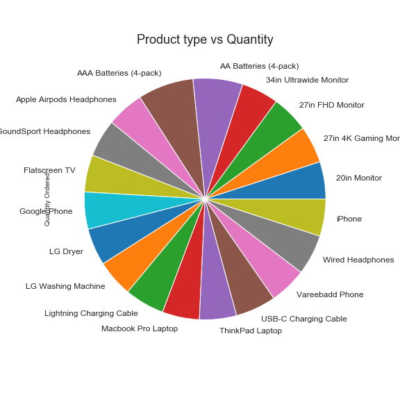
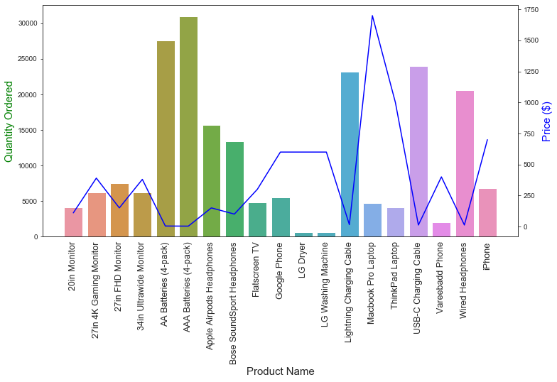

# sales_data_analysis 
Data analysis & visualization sales dataset with Python using Matplotlib, Pandas

## Dataset source:
[(https://github.com/KeithGalli/Pandas-Data-Science-Tasks/tree/master/SalesAnalysis/Sales_Data)]

## Objective
* Concatenating multiple csvs together to create a new DataFrame (pd.concat)
* Read dataset from csv file and generate pandas dataframes.
* Get information about the dataset using describe() & info().
* Use groupby() to display all products. Also display sum of their revenue.
* Generate a bar graph of 'Product' & mean of the 'price'.
* Generate a bar graph of 'Product type' & mean of the 'Quantity'.
* Display the sales break down by category.
* Finally bar and pie graph of 'Product line','Product type', 'Quantity'.

* Adding columns
* Parsing cells as strings to make new columns (.str)
* Using the .apply() method
* Using groupby to perform aggregate analysis
* Plotting bar charts and lines graphs to visualize our results
* Labeling our graphs
* Check how much is being generated by each product.
Pie graph of 'Product type' and 'Quantity Ordered'.

